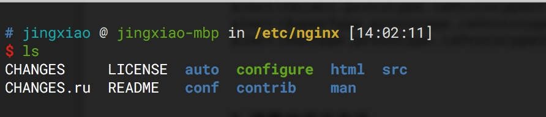
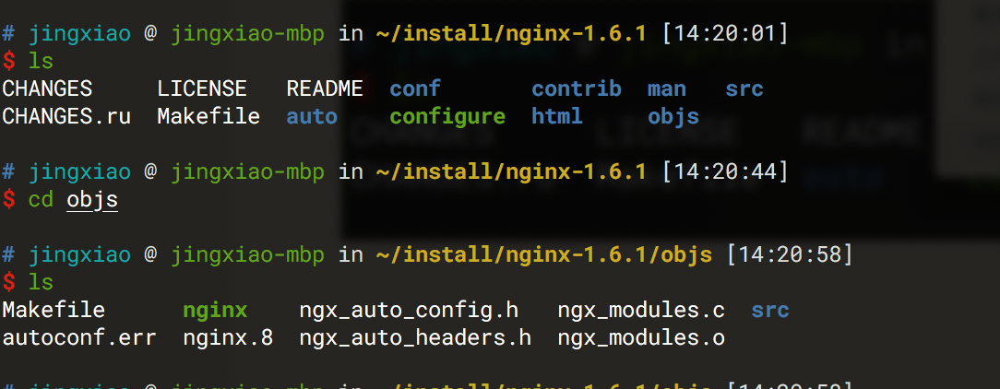
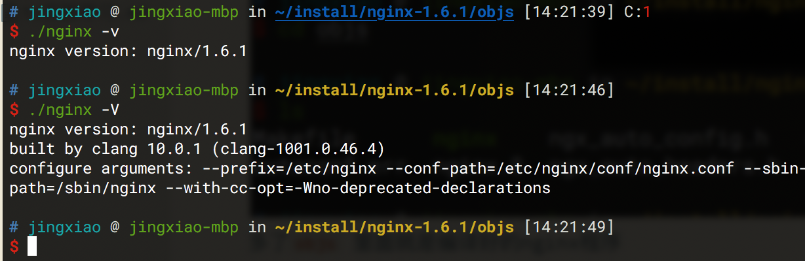
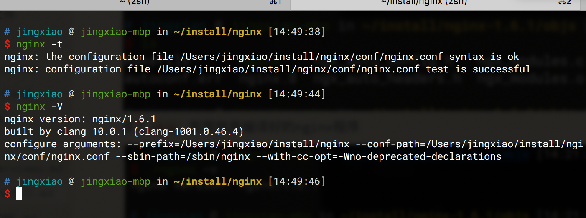
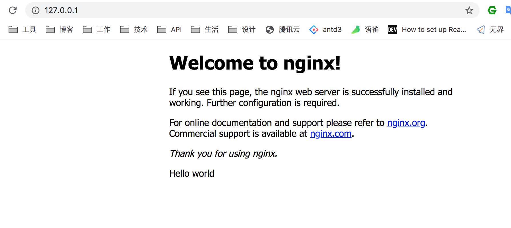
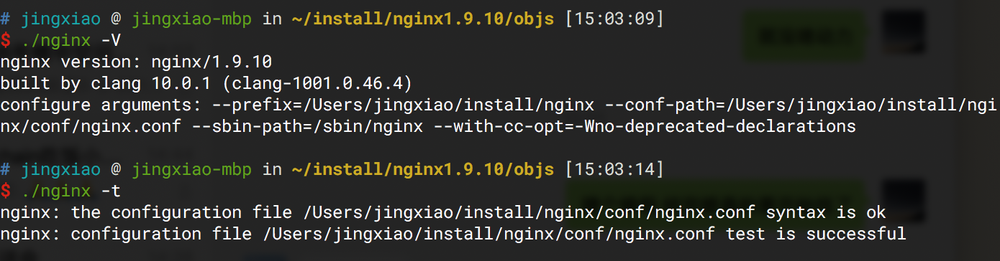
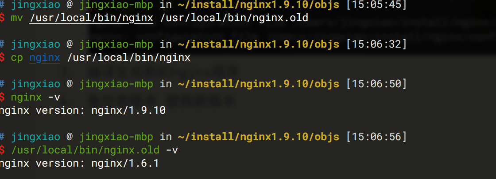
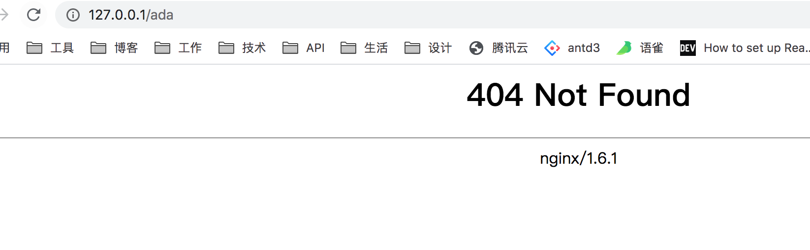
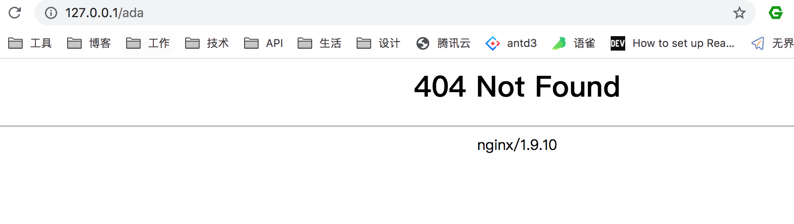

#### 前言

了解Nginx 使用 安装 基本配置等，

1. 卸载
2. 安装
3. 升级
4. 参数配置

#### 其他

1. 命令行所在目录 /bin /sbin /usr/bin /usr/sbin 这些里面放的指令有啥区别呢
2. Homebrew 
3. 软连接 环境变量

#### 卸载

之前是通过Homebrew安装的nginx，所以卸载直接就命令行`brew uninstall nginx` 实际上这条语句就是去`/usr/local/bin` 下删除`nginx` 程序。


#### 安装Nginx

macOS下可以通过`Homebrew`来安装，这里尝试通过另一种方式，`build nginx from source` 源码编译安装。

1. 官网[下载](http://nginx.org/download/)源码安装包(1.6.1) 然后解压 目录为`/etc/nginx` 

   

2. 配置参数和编译

   1. 通过 ./configure + 参数来[配置参数详情](http://nginx.org/en/docs/configure.html)
   2. 配置完后 `make`编译

   ```bash
   ./configure --prefix=/etc/nginx --conf-path=/etc/nginx/conf/nginx.conf 
   make
   ```

   **遇到的问题**
   'OSAtomicAdd64' is deprecated: first deprecated in macOS 10.12 - Use atomic_fetch_add_explicit(memory_order_relaxed)
   解决方案：[github -'OSAtomicAdd64' is deprecated: first deprecated in macOS 10.12 - Use atomic_fetch_add_explicit(memory_order_relaxed)](https://github.com/alibaba/tengine/issues/793)配置configure参数加上
   `./configure  --with-cc-opt="-Wno-deprecated-declarations"`

    

   多了`objs` 里面就是编译好的nginx程序

   

3. nginx程序拷贝到/usr/local/bin

   macOS SIP策略影响，即使是sudo也无法写入 `/bin /usr/bin` 所以将nginx写入`/usr/local/bin` 

   

   如果nginx安装好了，怎么去更改这个配置。--prefix 之类的

   


总得来说，就是下载源码，然后通过`./configure + 参数` 配置下可以使用的nginx程序，这一步包括比如希望nginx文件目录等，然后`make` 生成nginx程序。生成完，其实在当前目录通过`./nginx`就可以执行了，但是只限于当前目录下，所以要把这个移入到`/bin /usr/bin /sbin /usr/local/bin` 这种命令文件夹下，macOS有SIP限制，只能移入到`/usr/local/bin` 中。

**macOS指令**

启动：nginx
停止：nginx -s stop
重启：nginx -s reload


#### 升级 

平滑升级的方案 通过源码编译的方式来替换，就很简单了。

1. 下载新版本的包

2. 解压 配置（配置参数和之前的一样）

   

3. 编译生成新的nginx程序

4. 备份老版本 替换新版本 

   

   

   

​    `nginx -s reload`好像没生效，通过`nginx -s stop` 和`nginx` 先关了再启动。

#### 疑问

1. 装好后的`nginx` prefix参数怎么修改。

   参考：https://segmentfault.com/q/1010000000744034