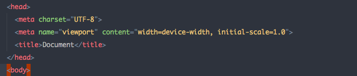

#### 知识点复习

参考：

https://segmentfault.com/a/1190000013311880
https://juejin.im/post/5b6d368b5188251b3c3b570b#heading-2

1 什么是<!doctype>
文档类型，告知浏览器用什么文档标准来解析。

- `BackCompat` 怪异模式，浏览器使用自己的怪异模式解析渲染页面（没有声明doctype时）
- `CSS1Compat` 标准模式 使用W3C标准解析渲染

2 meta标签

提供页面的一些信息 有助于seo

3 html语义化
用正确的标签做正确的事情，使得页面内容结构化，清晰，便于浏览器解析 有利于seo

4 浏览器内核理解
渲染引擎实现页面渲染（css dom树），js引擎解析和执行js来实现网页的动态效果。

5 html5新特性

- canvas
- 媒体标签 video audio
- 本地存储 localStorage sessionStorage
- 语义化标签
- 新的表单控件 calendar date url
- 新的技术 websocket geolocation webworker

6 渐进增强 优雅降级
base不一样，渐进增强优先考虑低版本浏览器然后再慢慢针对高版本浏览器进行效果交互优化；优雅降级则相反。

7 script引入脚本 defer和async区别
async同步，脚本下载完成就执行（中断页面渲染）
defer异步，页面渲染优先，其他脚本优先执行 渲染完再执行

8 浏览器页面之间通信

- localStorage 存储数据 
- 如果是页面跳转 可以通过url传值query参数
- window.open
- iframe页面message方式来传值
- 不跨域 document.cookie

