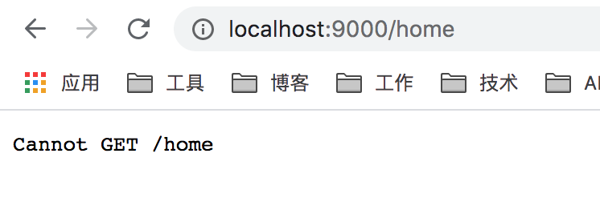

### React Router相关

1. 路由映射不生效

   

解决方案：
如果是webpack devServer启动的话需要设置`historyApiFallback: true`

[React-router v4 - cannot GET *url*](https://stackoverflow.com/questions/43209666/react-router-v4-cannot-get-url)

2. 引入antd样式 和css-modules冲突
   简单讲就是css-module会把antd样式哈希化了 导致不匹配

   